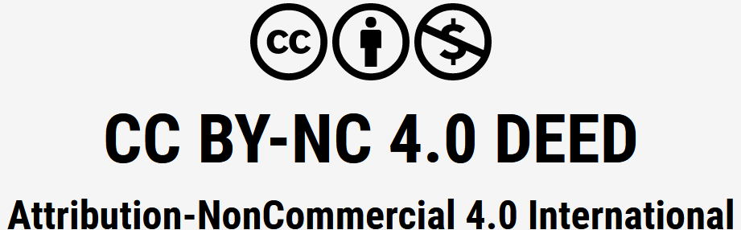

# Diary Management

_Diary Management_ is a school project carried out from november to december 2023 in 
the scope of our TI301I class "Algorithmics and Data Structure 2".
The aim of this project was to enhance our comprehension of data structures, algorithmics 
and C programming by making a diary management app that uses different structures to handle
itself. 

The project is divided in **3 parts**, each one with a different goal. This file will
give you a brief explanation on what this project is composed of and how to test and run
the different parts. For further explainations, please read the report provided with this
project folder.

## Requierments
It is strongly recomended to use Clion (or another C language IDE) to run this project,
since it was developped on it. The Diary management app will be launch within Clion's 
console or within your terminal if you compile and execute this project on your terminal.

The program may not work for versions of C inferior to C11.


## How to run the parts
Part 1 and 2 are an introduction to **multilevel linked lists** (or level lists for short).
The files concerned by this part are not used in the final version of the program (only part 3's are).
In oder to test them, a few manipulations are required.


### Overall
To test each the part :

* Erase the content of `main.c`, if there is any, so that only this stays :
 ```C
#include "Part_1-2/lvl_list.h"
#include "Part_1-2/timer.h"
#include "Part_3/contact_list.h"

int main() {
    /*
     * Copy here the main() from either "copy_main_1.c", "copy_main_2.c" or "copy_main_3.c".
     * Instructions of how to run each part is provided both on the files and the associated "READMEs.md".
     */

    return 0;
}
```

* Copy the content of a `copy_main_X.c` file in the `main()`. Do not keep
them as comments (don't take the `/*` or the `*/` when you copy it), or the 
program won't run.

### The `copy_main_X.c` files

|      File       |                                              Purpose                                              |  
|:---------------:|:-------------------------------------------------------------------------------------------------:|
| `copy_main_1.c` |            Gives an exemple of how to test part 1.<br/> You can modify it as you want.            | 
| `copy_main_2.c` | Generates a `log.txt` file, that you can later exploit on MATLAB. <br/> (method explained _here_) | 
| `copy_main_3.c` |                         Launches the actual Diary Management application.                         |


## License
[Diary Management](https://github.com/El0o/DiaryManagement) © 2023 de Elodie Duflaut, Elise Morana & Enora L'Azou est sous license [CC BY-NC 4.0](https://creativecommons.org/licenses/by-nc/4.0/?ref=chooser-v1)
